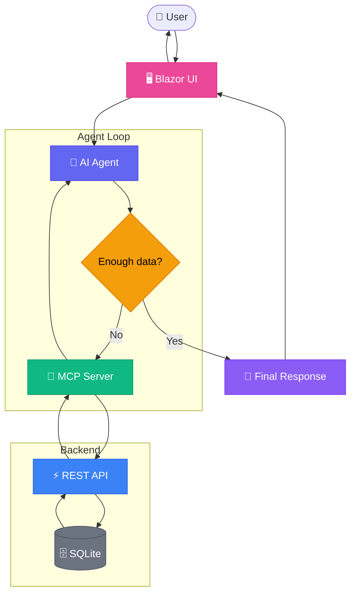

<div align="center">

# 🚨 IncidentAgentDemo

**Agentic AI system for incident management using OpenAI, MCP, and .NET**

[](https://dotnet.microsoft.com/)
[](https://platform.openai.com/)
[](https://modelcontextprotocol.io/)
[](https://dotnet.microsoft.com/apps/aspnet/web-apps/blazor)
[](https://github.com/hchadli/IncidentAgentDemo)
[](LICENSE.txt)

---

A production-style reference implementation of an **autonomous AI Agent** that manages cloud incidents through natural language. The agent reasons, selects tools, executes API calls, and responds — with full observability at every step.

[Overview](#overview) · [Architecture](#architecture) · [Features](#features) · [Quick Start](#quick-start) · [Demo](#demo-scenarios) · [Tech Stack](#tech-stack)

</div>

---

## Overview

IncidentAgentDemo is a multi-project .NET 10 solution that demonstrates how to build a **real agentic AI system** — not a chatbot wrapper, but an autonomous agent that:

- **Reasons** about what data it needs before answering
- **Selects tools** dynamically based on the user's intent
- **Executes actions** (queries, creates, closes incidents) through a structured MCP → API → DB pipeline
- **Loops until satisfied** — the agent decides when it has enough information to respond
- **Never hallucinates** operational data — everything comes from the database via tool calls

The system follows the **Model Context Protocol (MCP)** pattern, where the AI model interacts with backend services exclusively through well-defined tools with JSON Schema contracts.

---

## Key Concepts

| Concept | Role | Responsibility |
|---------|------|----------------|
| **AI Agent** | Decision maker | Decides *which* tools to call, *when* to call them, and *how* to compose the final answer |
| **MCP Server** | Tool bridge | Defines tool contracts (name, schema, description) and executes them against the API |
| **REST API** | Source of truth | Serves incident and health data from SQLite — never accessed directly by the agent |
| **Blazor UI** | User interface | 3-panel dashboard with chat, agent trace, and quick actions |

> The agent never fabricates data. If a tool call fails, it reports the failure — it doesn't guess.

---

## Architecture



### Agent Decision Flow

Each iteration of the agent loop (`IncidentAgentRunner.RunAsync`):

1. **Evaluate** — Does the model have enough information to answer?
2. **Select tools** — If not, pick one or more tools and provide arguments
3. **Execute** — MCP Server runs the tool against the API
4. **Loop or complete** — Feed results back to the model, repeat until done

Every decision is logged to the **Agent Trace** panel in real time.

---

## Project Structure

```
IncidentAgentDemo/
├── src/
│   ├── IncidentAgentDemo.Contracts/        # Shared DTOs and request/response records
│   ├── IncidentAgentDemo.Api/              # Minimal API + EF Core + SQLite
│   ├── IncidentAgentDemo.McpServer/        # Tool definitions, schemas, and execution
│   ├── IncidentAgentDemo.AgentHost/        # Agent loop, OpenAI SDK, prompt assets
│   └── IncidentAgentDemo.Web/              # Blazor Server UI (3-panel dashboard)
├── tests/
│   └── IncidentAgentDemo.Tests/            # xUnit integration and unit tests
├── .agents/
│   └── skills/
│       ├── incident-triage/SKILL.md        # Query and analyze incidents
│       ├── incident-lifecycle/SKILL.md     # Create and close incidents
│       ├── service-health/SKILL.md         # Check service health
│       ├── risk-summary/SKILL.md           # Combined risk assessment
│       └── demo-runbook/SKILL.md           # Demo walkthrough guidance
├── AGENTS.md                               # Global agent rules and architecture
└── README.md
```

---

## Features

### 🔍 Incident Triage
Query open incidents by service, analyze severity distribution, and identify the most critical issues.

### ➕ Incident Creation
Create new incidents from natural language — the agent extracts title, service, severity, and summary automatically.

### ✅ Incident Closure
Close incidents with optional resolution notes. The agent confirms the outcome before reporting success.

### 🏥 Service Health
Check real-time health status of platform services (Payments, Identity, Notifications).

### 📊 Risk Assessment
Combine incident data and service health into a unified risk summary — the agent calls multiple tools autonomously.

### 📋 Full Agent Trace
Every agent decision — tool selection, arguments, response parsing, iteration count — is visible in the trace panel.

### 📄 Prompt Assets
Runtime-loaded `AGENTS.md` and `SKILL.md` files shape agent behavior without code changes. Skills are resolved by keyword matching and composed into the system prompt dynamically.

---

## MCP Tools

| Tool | Type | Description |
|------|------|-------------|
| `get_open_incidents` | Read | Retrieve open incidents, optionally filtered by service |
| `get_incident_by_id` | Read | Get full details for a specific incident |
| `get_service_health` | Read | Check health status of a platform service |
| `create_incident` | Write | Create a new incident with title, service, severity, and summary |
| `close_incident` | Write | Close an existing incident with optional resolution note |

All tools return structured JSON. Write tools include a `success` flag for the model to confirm outcomes.

---

## API Endpoints

| Method | Endpoint | Description |
|--------|----------|-------------|
| `GET` | `/incidents/open?serviceName=X` | Open incidents, optionally filtered by service |
| `GET` | `/incidents/{id}` | Single incident by ID |
| `POST` | `/incidents` | Create a new incident |
| `POST` | `/incidents/{id}/close` | Close an existing incident |
| `GET` | `/services/{name}/health` | Service health status |

---

## Prompt Assets

The agent's behavior is shaped by markdown files loaded at runtime:

### `AGENTS.md`
Global rules — coding standards, tool design rules, critical constraints (e.g., *"never hallucinate incident data"*).

### `SKILL.md` Files
Each skill describes a capability: when to use it, which tools to call, expected inputs/outputs, and example interactions. Skills are resolved via keyword matching against the user's prompt and composed into the system instructions dynamically.

| Skill | Purpose |
|-------|---------|
| `incident-triage` | Query and analyze open incidents |
| `incident-lifecycle` | Create and close incidents |
| `service-health` | Check platform service health |
| `risk-summary` | Combined risk assessment |
| `demo-runbook` | Demo walkthrough and architecture explainer |

---

## Quick Start

### Prerequisites

- [.NET 10 SDK](https://dotnet.microsoft.com/download)
- [OpenAI API key](https://platform.openai.com/api-keys)

### 1. Configure API Key

```bash
cd src/IncidentAgentDemo.Web
dotnet user-secrets set "OpenAI:ApiKey" "sk-your-key-here"
```

### 2. Start the API

```bash
cd src/IncidentAgentDemo.Api
dotnet run
# → http://localhost:5006
```

### 3. Start the Blazor UI

```bash
cd src/IncidentAgentDemo.Web
dotnet run
# → http://localhost:5046
```

### 4. Run Tests

```bash
dotnet test
```

---

## Demo Scenarios

| Prompt | Agent Behavior |
|--------|----------------|
| *"Show me open incidents for Payments"* | Calls `get_open_incidents` → formats severity breakdown |
| *"What is the health of Identity?"* | Calls `get_service_health` → reports status and notes |
| *"Summarise the risk for Notifications"* | Calls `get_open_incidents` + `get_service_health` → composes risk summary |
| *"Show me incident 2 and tell me if it's critical"* | Calls `get_incident_by_id` → evaluates severity |
| *"Create a high severity incident for Payments about failed transactions"* | Calls `create_incident` → confirms new incident ID |
| *"Close incident 5 with note: fixed after config rollback"* | Calls `close_incident` → confirms closure and resolution |

### UI Layout

| Panel | Purpose |
|-------|---------|
| **Left Sidebar** | Quick prompts, action buttons, architecture explainer |
| **Center** | Chat-style interaction with the agent |
| **Right** | Real-time agent trace — every tool call and decision step |

---

## Tech Stack

| Layer | Technology |
|-------|-----------|
| **Runtime** | .NET 10, C# 14 |
| **AI** | OpenAI .NET SDK 2.9.1 — Responses API |
| **UI** | Blazor Web App (Interactive Server) |
| **API** | ASP.NET Core Minimal API |
| **Data** | EF Core 10 + SQLite |
| **Testing** | xUnit, Microsoft.AspNetCore.Mvc.Testing, EF Core InMemory |
| **Architecture** | Agentic AI, Model Context Protocol (MCP), Dependency Injection |

---

## Why This Project Matters

Most AI demos are thin wrappers around a chat API. This project demonstrates a **real agentic pattern**:

- **Autonomous tool selection** — the model decides what to call, not hardcoded logic
- **Multi-step reasoning** — the agent loops until it has enough data, making multiple tool calls when needed
- **Full observability** — every decision is traced and visible in the UI
- **Structured tool contracts** — JSON Schema definitions, not string parsing
- **Read and write operations** — the agent can query, create, and close incidents
- **Runtime prompt engineering** — agent behavior is shaped by markdown files, not compiled code
- **Production patterns** — DI, async/await, DTOs, validation, error handling, structured logging

It's a reference architecture for building agentic systems on .NET that goes beyond *"call the API and print the result."*

---

## License

This project is licensed under the [MIT License](LICENSE.txt).
