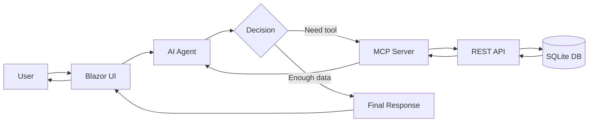

# IncidentAgentDemo

A real AI Agent system built with .NET 10, Blazor, OpenAI Responses API, MCP Server pattern, and SQLite.

## Architecture



### Where the Agent Decides

The agent loop is the core of this system. On each iteration the AI model:

1. **Evaluates the conversation** — does it have enough information to answer?
2. **Selects tools** — if not, it picks one or more tools and provides arguments.
3. **Processes results** — tool outputs are fed back to the model.
4. **Loops or completes** — the model may request more tools or generate the final answer.

These decisions happen inside `IncidentAgentRunner.RunAsync()` and are visible in the Agent Trace panel.

## Solution Structure

```
IncidentAgentDemo/
├── src/
│   ├── IncidentAgentDemo.Contracts/     # Shared DTOs
│   ├── IncidentAgentDemo.Api/           # Minimal API + EF Core + SQLite
│   ├── IncidentAgentDemo.McpServer/     # Tool definitions + execution
│   ├── IncidentAgentDemo.AgentHost/     # Agent loop + OpenAI Responses API
│   └── IncidentAgentDemo.Web/           # Blazor Server UI (3-panel dashboard)
├── tests/
│   └── IncidentAgentDemo.Tests/         # xUnit integration + unit tests
├── .agents/skills/                      # Skill documentation
│   ├── incident-triage/SKILL.md
│   ├── service-health/SKILL.md
│   ├── risk-summary/SKILL.md
│   └── demo-runbook/SKILL.md
├── AGENTS.md                            # Agent architecture & rules
└── README.md
```

## Tech Stack

- **.NET 10** — latest framework
- **Blazor Web App** — Interactive Server rendering
- **ASP.NET Core Minimal API** — lightweight REST endpoints
- **EF Core + SQLite** — simple persistent storage
- **OpenAI .NET SDK** — Responses API (modern, not legacy chat)
- **Dependency Injection** — throughout all layers
- **async/await** — everywhere

## Prerequisites

- [.NET 10 SDK](https://dotnet.microsoft.com/download)
- An [OpenAI API key](https://platform.openai.com/api-keys)

## Setup

### 1. Set your OpenAI API key

**Option A — User secrets (recommended):**
```bash
cd src/IncidentAgentDemo.Web
dotnet user-secrets init
dotnet user-secrets set "OpenAI:ApiKey" "sk-your-key-here"
```

**Option B — Environment variable:**
```bash
# PowerShell
$env:OPENAI_API_KEY = "sk-your-key-here"

# Bash
export OPENAI_API_KEY=sk-your-key-here
```

### 2. Start the API

```bash
cd src/IncidentAgentDemo.Api
dotnet run
```
The API starts on `http://localhost:5006` and seeds the SQLite database automatically.

### 3. Start the Blazor UI

```bash
cd src/IncidentAgentDemo.Web
dotnet run
```
Open `http://localhost:5046` in your browser.

### 4. Run tests

```bash
dotnet test
```

## Demo Prompts

Try these in the chat:

| Prompt | What Happens |
|--------|-------------|
| "Show me open production incidents for Payments" | Agent calls `get_open_incidents` |
| "What is the health of the Identity service?" | Agent calls `get_service_health` |
| "Summarise the risk for Notifications" | Agent calls both tools autonomously |
| "Show me incident 2 and tell me if it's critical" | Agent calls `get_incident_by_id` |
| "Which service has the most critical issues?" | Agent queries across all services |

## UI Layout

| Panel | Purpose |
|-------|---------|
| **Left Sidebar** | Navigation, canned prompts, architecture explainer |
| **Center Panel** | Chat-style interaction with the agent |
| **Right Panel** | Real-time agent trace showing every decision step |

## API Endpoints

| Endpoint | Description |
|----------|-------------|
| `GET /incidents/open?serviceName=X` | Open incidents, optionally filtered |
| `GET /incidents/{id}` | Single incident by ID |
| `GET /services/{name}/health` | Service health status |

## License

This is a demo/educational project. Use freely.
